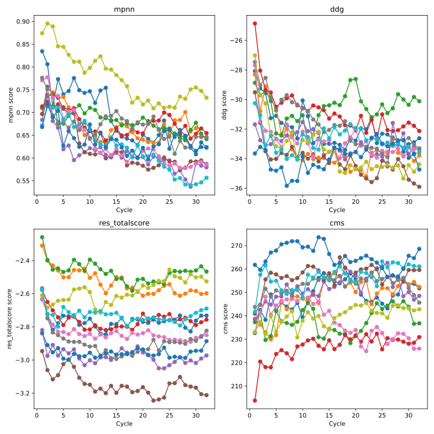

# Iterative LigandMPNN-FastRelax for Backbone Optimization

**Author:** David Hyunyoo Jang  
**Affiliation:** [Artificial Intelligence Protein Design Lab](https://sites.google.com/view/aipdlab)  
**Date:** July 2025

## Overview

An iterative protein design pipeline that combines LigandMPNN sequence generation with PyRosetta FastRelax optimization. Through repeated cycles of sequence design and structural relaxation, this method can improve protein backbone geometry and binding affinity.


*Figure: Optimization results across 32 cycles for protein-ligand complexes, showing improvements in MPNN scores and binding energies (DDG).*

### Key Features

This implementation extends the original LigandMPNN-FR concept (Gyu Rie Lee, 2022) by incorporating **structural relaxation within each cycle**, rather than only at the end. This enables gradual backbone optimization through iterative design-relax cycles.

## Installation

### Environment Setup

```bash
# Create conda environment with required dependencies
mamba create -n ligmpnn-fr -y \
    -c nvidia -c pytorch -c conda-forge \
    python=3.12 \
    pytorch pytorch-cuda=12.4 \
    numpy scipy pandas \
    openbabel

conda activate ligmpnn-fr

# Install specialized packages
pip install git+https://github.com/jamesmkrieger/ProDy@unpin_numpy
```

### Core Dependencies Installation

```bash
# 1. LigandMPNN
git clone https://github.com/daylight-00/LigandMPNN.git
cd LigandMPNN
# Follow LigandMPNN installation instructions

# 2. PyRosetta
# Download PyRosetta from https://www.pyrosetta.org/downloads
# Extract and install according to PyRosetta documentation

# 3. This repository
git clone https://github.com/yourusername/ligandmpnn-fastrelax.git
cd ligandmpnn-fastrelax
```

## Key Improvements from Original Implementation

### 1. **Per-Cycle Relaxation**
- **Original**: Single final relaxation step
- **This version**: Structural relaxation within each cycle, enabling gradual backbone optimization

### 2. **Updated LigandMPNN API**
- Updated from development-stage to current stable API
- Uses `data_utils` and `model_utils` with proper `feature_dict`
- Compatible with LigandMPNN v_32_010_25

### 3. **Code Improvements**
- **Distance constraints**: BioPython + NumPy instead of manual parsing (89 → 51 lines)
- **Vectorized calculations** for better performance
- **Parallel processing**: Multiprocessing support for FastRelax optimization
- **Better error handling**

## Algorithm

```
Input: Protein-ligand complex PDB + ligand parameters
    ↓
┌─→ [Iteration Cycle] ←─┐
│   │                   │
│   ├── 1. LigandMPNN Sequence Design
│   │   └── Generate new amino acid sequence
│   │
│   ├── 2. Side Chain Packing (Optional)
│   │   └── Optimize side chain conformations
│   │
│   ├── 3. PyRosetta FastRelax
│   │   ├── Full backbone + side chain optimization
│   │   ├── Apply distance constraints (optional)
│   │   └── Energy minimization
│   │
│   ├── 4. Structure Evaluation
│   │   ├── Calculate Rosetta energy
│   │   └── Evaluate MPNN score
│   │
│   └── 5. Select Best Structure → Next Cycle
└──────────────────────────────────────┘
```

### Differences from Original Implementation

| Aspect | Original | This Implementation |
|--------|----------|-------------------|
| **Relaxation** | Final step only | Per-cycle relaxation |
| **Backbone** | Static | Gradual optimization |
| **API** | Development version | Current stable API |
| **Parsing** | Manual | BioPython-based |

## Usage

### Quick Start

```bash
python ligandmpnn_fastrelax_complete.py \
    --pdb_path protein_ligand_complex.pdb \
    --ligand_params_path ligand.params \
    --out_folder output_directory \
    --n_cycles 5
```

### Example Data

See `example/` directory for sample input files and analysis scripts:
- `example/lmpnn_fr.py` - Example optimization workflow
- `example/fastrelax_scores.svg` - Visualization of optimization results

### Basic Example

```bash
# Standard optimization with 8 cycles
python ligandmpnn_fastrelax_complete.py \
    --pdb_path complex.pdb \
    --ligand_params_path ligand.params \
    --out_folder results \
    --n_cycles 8 \
    --temperature 0.1 \
    --num_seq_per_target 4 \
    --save_stats
```

### Advanced Usage

```bash
# High-throughput optimization with parallel processing
python ligandmpnn_fastrelax_complete.py \
    --pdb_path complex.pdb \
    --ligand_params_path ligand.params \
    --out_folder results \
    --n_cycles 16 \
    --num_seq_per_target 8 \
    --num_processes 8 \
    --pyrosetta_threads 4 \
    --pack_side_chains \
    --temperature 0.15 \
    --target_atm_for_cst "O1,N1,N2" \
    --save_stats
```

## Command Line Options

### Required Arguments
| Argument | Description |
|----------|-------------|
| `--pdb_path` | Input protein-ligand complex PDB file |
| `--ligand_params_path` | Rosetta ligand parameters file (.params) |
| `--out_folder` | Output directory for results |

### Core Parameters
| Argument | Default | Description |
|----------|---------|-------------|
| `--n_cycles` | 3 | Number of design-optimization cycles |
| `--temperature` | 0.1 | LigandMPNN sampling temperature (0.05-0.3) |
| `--num_seq_per_target` | 1 | Sequences generated per cycle |

### Optimization Controls
| Argument | Default | Description |
|----------|---------|-------------|
| `--pack_side_chains` | False | Enable side chain packing optimization |
| `--target_atm_for_cst` | "" | Ligand atoms for distance constraints (e.g., "O1,N1,N2") |
| `--selection_metric` | "ddg" | Metric for structure selection (ddg/totalscore/cms) |

### Performance Settings
| Argument | Default | Description |
|----------|---------|-------------|
| `--num_processes` | 1 | Parallel processes for relaxation |
| `--pyrosetta_threads` | 1 | Threads per PyRosetta process |

### Advanced Options
| Argument | Default | Description |
|----------|---------|-------------|
| `--redesigned_residues` | [] | Specific residues to redesign (e.g., "A45 A46 A48") |
| `--fixed_residues` | [] | Residues to keep unchanged |
| `--omit_AAs` | "X" | Amino acids to exclude from design |
| `--save_stats` | False | Save detailed statistics |

## Output Structure

```
output_directory/
├── seqs/                          # Generated sequences
│   ├── input_cycle_1.fa          #   FASTA format with MPNN scores
│   └── input_cycle_N.fa
├── backbones/                     # Intermediate structures
│   ├── input_cycle_1_threaded.pdb #   Post-threading structures
│   └── input_cycle_N_threaded.pdb
├── relaxed/                       # Optimized structures
│   ├── input_cycle_1_relaxed.pdb #   Final relaxed structures
│   └── input_cycle_N_relaxed.pdb
└── stats/ (optional)             # Performance metrics
    ├── input_cycle_1.json        #   Energy/score statistics
    └── input_cycle_N.json
```

## Technical Details

### Distance Constraints

Distance constraints between ligand atoms and nearby protein residues maintain binding geometry:

```python
def extract_dist_cst_from_pdb(pdb_in, lig_tr_atms, bsite_res=''):
    parser = PDBParser(QUIET=True)
    # Vectorized distance calculations with NumPy
    # Generates: AtomPair O1 147 CA 45 HARMONIC 3.2 0.5
```

### Performance Features

- **Parallel Processing**: Multiple structures relaxed simultaneously using multiprocessing
- **Multithreading**: Configurable thread allocation per PyRosetta process
- **GPU Acceleration**: LigandMPNN inference on CUDA
- **Vectorized Operations**: NumPy-based calculations

## Results

**Optimization metrics** from runs with protein-ligand complexes:

- **MPNN Score**: ~0.85 → ~0.55 (lower is better)
- **DDG**: ~-25 → ~-35 REU (binding energy improvement)
- **Residue Total Score**: Stabilized around -2.4 to -3.2 REU
- **CMS**: Maintained ~240-270 (confidence levels)

Most improvements occur within the first 10-15 cycles.

## Troubleshooting

**Common Issues:**
1. **Memory errors**: Reduce `--num_processes` or `--pyrosetta_threads`
2. **Slow performance**: Check GPU availability for LigandMPNN
3. **Missing ligand**: Verify `.params` file path and format
4. **Poor optimization**: Try different `--temperature` values (0.05-0.3)

**Tips:**
- Use `--pack_side_chains` for better optimization
- Set `--target_atm_for_cst` for key ligand interactions
- Monitor with `--save_stats`

## Citation

```bibtex
@software{jang2025_ligandmpnn_fastrelax,
  author = {Jang, David Hyunyoo},
  title = {Iterative LigandMPNN-FastRelax for Backbone Optimization},
  year = {2025},
  url = {https://github.com/daylight/ligandMPNN_FR}
}
```

**Related Work:**
- **LigandMPNN**: Dauparas et al. (2022)
- **PyRosetta**: Chaudhury et al. (2010)

**Acknowledgments:**
- Gyu Rie Lee - Original concept and supervision
