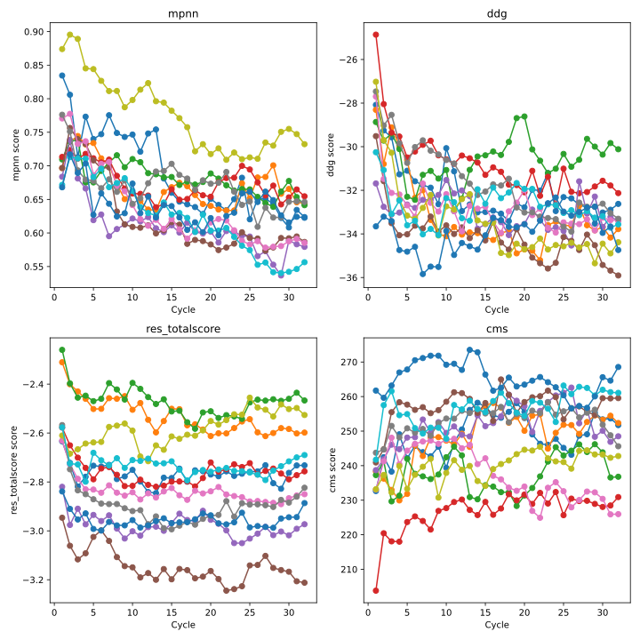

# Metric-Guided LigandMPNN Recycling for Backbone-Conditioned Sequence Sampling Space Optimization


*Figure: Optimization results across 32 cycles for protein-ligand complexes, showing improvements in MPNN scores and binding energies (DDG).*

This repository implements a **directional LigandMPNN–FastRelax recycling pipeline** for protein–ligand design. Instead of only drawing more LigandMPNN samples from a fixed input backbone, the pipeline uses post-relaxation metrics to select the best relaxed protein–ligand state and recycles that state into the next LigandMPNN sampling round.

In short:

```text
sample sequence candidates
→ relax each candidate
→ evaluate post-relaxation metrics
→ recycle the best relaxed state
→ sample again from the updated backbone-ligand state
```

## Key idea

LigandMPNN does not sample sequences from a global sequence space. Its sequence proposals are conditioned on the input protein backbone, ligand geometry, and optional side-chain/atom context.

Therefore, increasing the number of samples from a single fixed backbone mainly explores the local sequence distribution around that backbone. This project reframes candidate generation as an optimization problem over **backbone-conditioned sequence sampling spaces**:

> Find a backbone-ligand input state from which LigandMPNN samples better-scoring and more designable sequence candidates.

The search is implemented as **stochastic proposal + directional selection**:

1. LigandMPNN stochastically proposes a pool of sequences from the current input structure.
2. Each candidate is structurally instantiated and relaxed with PyRosetta FastRelax.
3. A configurable post-relaxation metric selects the best candidate.
4. The selected relaxed structure becomes the next LigandMPNN input state.

The default steering metric is Rosetta `ddg`, but the code supports alternative selection metrics.

## Workflow

```text
Input protein-ligand state B_t
        │
        ▼
LigandMPNN samples N sequences from P(seq | B_t)
        │
        ▼
Generate candidate structures
        │
        ├─ LigandMPNN side-chain packing (optional)
        │
        ▼
PyRosetta FastRelax for each candidate
        │
        ├─ ligand-distance constraints (optional)
        ├─ Rosetta metrics: ddg, totalscore, res_totalscore, cms
        │
        ▼
Select best relaxed candidate by selection metric
        │
        ▼
Recycle selected relaxed state as B_{t+1}
        │
        └── repeat for n_cycles
```

The selected state is both the current best design and the input distribution-defining structure for the next cycle.

## What is optimized?

This pipeline does **not** directly optimize a single sequence in isolation. It optimizes the **input protein-ligand state** that defines the next LigandMPNN sampling distribution.

A useful interpretation is:

```text
Objective:
  improve the best candidate reachable from the next LigandMPNN sampling pool

State:
  relaxed protein-ligand structure recycled into the next cycle

Update rule:
  choose the post-relaxation candidate with the best selection metric
```

This is a greedy, metric-guided directional search over local backbone-ligand states. It should not be interpreted as global backbone optimization.

## Features

- LigandMPNN sequence sampling from protein-ligand complexes
- Optional LigandMPNN side-chain packing before Rosetta refinement
- PyRosetta FastRelax for every candidate in every cycle
- Configurable metric-guided candidate selection
- Parallel FastRelax execution with multiprocessing
- Optional ligand-distance constraints from selected ligand atoms
- Per-cycle FASTA, relaxed PDB, and JSON statistics outputs

## Installation

### 1. Create an environment

```bash
conda create -n ligmpnn-fr -y \
    -c nvidia -c pytorch -c conda-forge \
    python=3.12 \
    pytorch pytorch-cuda=12.4 \
    numpy scipy pandas \
    openbabel

conda activate ligmpnn-fr
```

### 2. Install LigandMPNN

```bash
git clone https://github.com/daylight-00/LigandMPNN.git
cd LigandMPNN
# Follow LigandMPNN installation and model-weight setup instructions.
```

### 3. Install PyRosetta

Download PyRosetta from the official PyRosetta distribution page and install it according to your license and platform.

### 4. Clone this repository

```bash
git clone https://github.com/daylight-00/ligandMPNN_FR.git
cd ligandMPNN_FR
```

## Usage

### Minimal run

```bash
python ligandmpnn_fastrelax_complete.py \
    --pdb_path protein_ligand_complex.pdb \
    --ligand_params_path ligand.params \
    --out_folder results \
    --n_cycles 5
```

### Metric-guided recycling run

```bash
python ligandmpnn_fastrelax_complete.py \
    --pdb_path complex.pdb \
    --ligand_params_path ligand.params \
    --out_folder results \
    --n_cycles 8 \
    --num_seq_per_target 8 \
    --temperature 0.1 \
    --selection_metric ddg \
    --selection_order ascending \
    --target_atm_for_cst "O1,N1,N2" \
    --save_stats
```

### Parallel FastRelax with LigandMPNN side-chain packing

```bash
python ligandmpnn_fastrelax_complete.py \
    --pdb_path complex.pdb \
    --ligand_params_path ligand.params \
    --out_folder results \
    --n_cycles 16 \
    --num_seq_per_target 8 \
    --num_processes 8 \
    --pyrosetta_threads 2 \
    --pack_side_chains \
    --pack_with_ligand_context 1 \
    --selection_metric ddg \
    --selection_order ascending \
    --target_atm_for_cst "O1,N1,N2" \
    --save_stats
```

## Important arguments

### Required inputs

| Argument | Description |
|---|---|
| `--pdb_path` | Input protein-ligand complex PDB |
| `--ligand_params_path` | Rosetta ligand `.params` file |
| `--out_folder` | Output directory |

### Sampling and recycling

| Argument | Default | Description |
|---|---:|---|
| `--n_cycles` | `3` | Number of LigandMPNN–FastRelax recycling cycles |
| `--num_seq_per_target` | `1` | Number of LigandMPNN sequence candidates generated per cycle |
| `--temperature` | `0.1` | LigandMPNN sampling temperature |
| `--selection_metric` | `ddg` | Metric used to select the recycled state |
| `--selection_order` | `ascending` | Whether lower or higher metric values are better |

### Supported selection metrics

| Metric | Interpretation | Typical order |
|---|---|---|
| `mpnn` | LigandMPNN sequence score | ascending |
| `ddg` | Rosetta binding metric after unconstrained FastRelax | ascending |
| `ddg_after_relax_cst` | Rosetta binding metric after constrained relaxation | ascending |
| `totalscore` | Rosetta total score | ascending |
| `res_totalscore` | Residue-normalized total score | ascending |
| `cms` | Contact molecular surface | descending |

`ddg` is the default because it worked as an effective steering signal in the tested workflow. It should be interpreted as a computational selection metric, not as an experimental binding affinity.

### Structure and constraint controls

| Argument | Default | Description |
|---|---:|---|
| `--pack_side_chains` | `False` | Use LigandMPNN side-chain packer before FastRelax |
| `--pack_with_ligand_context` | `1` | Include ligand context during side-chain packing |
| `--repack_everything` | `False` | Repack all residues during LigandMPNN side-chain packing |
| `--target_atm_for_cst` | `""` | Comma-separated ligand atoms used to generate distance constraints |
| `--repackable_res` | `""` | Comma-separated residue numbers allowed for Rosetta repacking |

### Performance

| Argument | Default | Description |
|---|---:|---|
| `--max_batch_size` | `1` | Maximum LigandMPNN sampling batch size |
| `--num_processes` | `1` | Number of parallel FastRelax worker processes |
| `--pyrosetta_threads` | `1` | Rosetta threads per worker process |

## Output structure

```text
results/
├── seqs/
│   ├── <input>_cycle_1.fa
│   ├── <input>_cycle_1_best.fa
│   └── ...
├── backbones/
│   ├── <input>_cycle_1_seq_0.pdb
│   ├── <input>_cycle_1_seq_1.pdb
│   └── ...
├── relaxed/
│   ├── <input>_cycle_1_seq_0_relaxed.pdb
│   ├── <input>_cycle_1_seq_1_relaxed.pdb
│   ├── <input>_cycle_1_relaxed.pdb      # selected best structure
│   └── ...
└── stats/
    ├── <input>_cycle_1.json
    └── ...
```

Each cycle stores all generated sequences, candidate structures, relaxed structures, and the selected best relaxed state. When `--save_stats` is enabled, JSON files include MPNN scores, selection metric values, Rosetta metrics, and cycle metadata.

## Observed optimization trends

In example runs, ddG-guided recycling showed two useful computational trends:

- the minimum Rosetta `ddg` within each sampled candidate pool decreased across cycles;
- the MPNN score of the selected design improved across cycles.

These observations support the interpretation that recycling the best post-relaxation state can shift the subsequent LigandMPNN sampling distribution toward more favorable and more designable candidates. These are computational trends and should be validated experimentally for any specific design campaign.

## Notes and limitations

- FastRelax provides local structural refinement; it is not a global backbone search method.
- Rosetta `ddg` is a steering metric, not experimental binding affinity.
- Greedy best-one recycling can reduce diversity across cycles. A future extension could recycle top-K states or use beam search.
- Regenerating constraints from the current candidate can enable adaptive local search, but it may also allow drift from an initial binding motif if constraints are not chosen carefully.
- Final designs should be checked with additional filters, structural inspection, and experimental validation.

## Relationship to the original LigandMPNN-FR script

This project builds on the 2022 LigandMPNN-FR concept by Gyu Rie Lee. The original script already contained an important recycling idea: LigandMPNN-designed sequences were threaded and refined with Rosetta, and the resulting PDBs were reused as inputs for later LigandMPNN cycles.

The current implementation changes the role of recycling:

```text
Original view:
  LigandMPNN output → Rosetta cleanup/refinement → recycle structures

Current view:
  candidate pool → FastRelax every candidate → metric-guided best-state selection → recycle selected state
```

The central methodological change is that Rosetta metrics are no longer only recorded after refinement. They become the steering signal that determines which backbone-ligand state defines the next LigandMPNN sampling space.

See [`original_script/`](original_script/) for the preserved baseline script and a more detailed comparison.

## Relationship to Other Projects

This repository is complementary to the [*ligand_binder_design*](https://github.com/daylight-00/ligand_binder_design) project.

```text
ligand_binder_design:
    end-to-end target-design workflow
    generation → filtering → sequence design → refolding → metric lineage

ligandMPNN_FR:
    metric-guided LigandMPNN–FastRelax recycling
    optimization of backbone-conditioned sequence sampling spaces
```

Together, the two projects represent different layers of the small-molecule binder design process: a practical binder-design campaign pipeline and a more focused optimization strategy for improving candidate pools.

## Citation

```bibtex
@software{jang2025_metric_guided_ligandmpnn_recycling,
  author = {Jang, David Hyunyoo},
  title = {Metric-Guided LigandMPNN Recycling for Backbone-Conditioned Sequence Space Optimization},
  year = {2025},
  url = {https://github.com/daylight-00/ligandMPNN_FR}
}
```

## Acknowledgements

This project was developed during a research internship in the [*Artificial Intelligence Protein Design Lab*](https://sites.google.com/view/aipdlab) under the supervision of Prof. Gyu Rie Lee. It builds on Prof. Lee’s earlier LigandMPNN–Rosetta recycling workflow and reframes the loop as a metric-guided search over backbone-conditioned sequence sampling spaces.

## References

- LigandMPNN: Dauparas et al.
- PyRosetta: Chaudhury et al.
